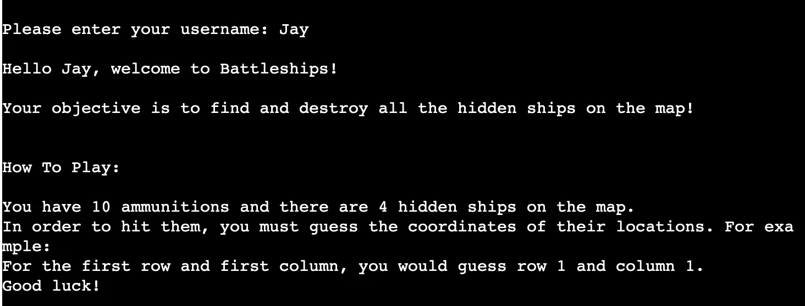
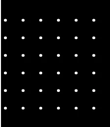
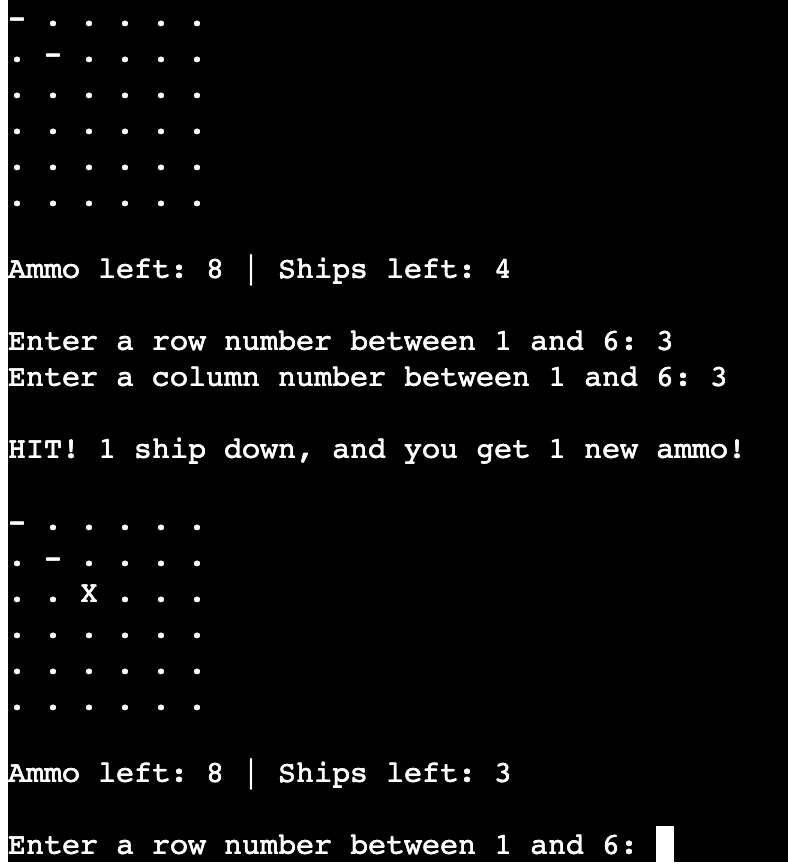
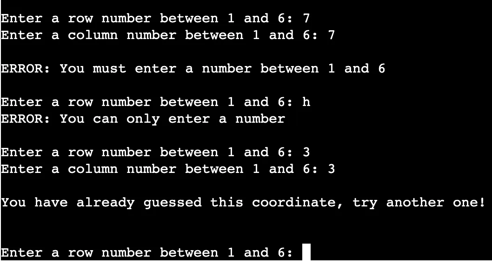

# Battleships Game

Battleships game is a Python terminal game, which runs in the terminal on Heroku.

The computer generates a game board with 4 hidden ships, and users can try and guess the coordinates of the ships. Each ship occupies one space on the board.

Here is the live version of my project.

## How to play

Battleships is a classic board game and also a pen and paper game, you can read more about it here - https://en.wikipedia.org/wiki/Battleship_(game)

In this version, the player begins by entering their username and pressing enter, and then the computer displays the instructions for this version of the game.

The computer then generates a game board with 6 rows and 6 columns, with each space on the board indicated by a dot, and asks the user to guess a row number, followed by a column number, to try and hit one of the 4 hidden ships.

If the user gets a hit, the space will be marked with an X, and if they get a miss, the space is marked with a -.

The user starts with 10 ammunitions (ammo), and they lose 1 ammo each time they miss.

When they get a hit, they get 1 ammo added back onto their total.

If the user hits all 4 ships they win, and if they run out of ammo they lose.

## Features 

### Existing Features

- __Username Prompt and Instructions__

  - Computer asks player to enter their username and then uses the username in a welcome message.
  - Instructions for the game are shown

- __Random Board Generation__

  - Ships are randomly placed on the game board
  - The player cannot see where the ships are

  - Play Against The Computer

  - Accepts User Input

  - Maintains Scores

- __Input Validation and Error-Checking__

  - Users cannot enter coordinates outside the range of 1-6
  - Users must enter numbers
  - Users cannot guess the same space on the board twice

### Future Features

  - Allow users to choose board size and number of ships
  - Create second game board for the user to place their own ships and have the computer make guesses in return
  - Store users scores on a spreadsheet
  - Have ships that take up more than 1 space on the board
  - Add coloured aspects to the game e.g. - turns red for a miss, X turns green for a hit.

## Testing

I have manually tested this project by doing the following:

  - Passed the code through the Code Institute PEP8 linter, there was one problem which was that a few lines contained too many characters.
  - Given invalid inputs: strings instead of numbers, out of range numbers, and previously guessed coordinates.
  - Tested in my local terminal and in the Code Institute Heroku terminal.

### Bugs

#### Solved Bugs

  - Initially the username prompt was being printed twice in the terminal because I was mistakenly calling the function in 2 places, this was resolved.

#### Remaining Bugs

  - No bugs remaining.

### Validator Testing

  - No other errors were returned from the PEP8 validatoe, other than the character length of some of the lines.

## Deployment

This project was deployed using Code Institute's mock terminal for Heroku.

- __Steps For Deployment__

  - Create a new Heroku app
  - Set the buildpacks to Python and NodeJS in that order
  - Link the Heroku app to the repository
  - Click on Deploy

## Credits

  - Various YouTube tutorials for guidance on building Battleships games with Python
  - Google searches to help with specific parts of building the game
  - Code Institute for the deployment terminal
  - Code Institute for the sample README.md file